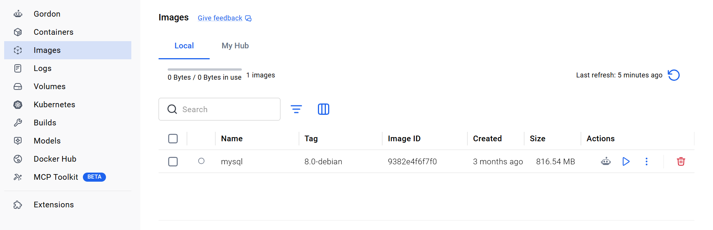
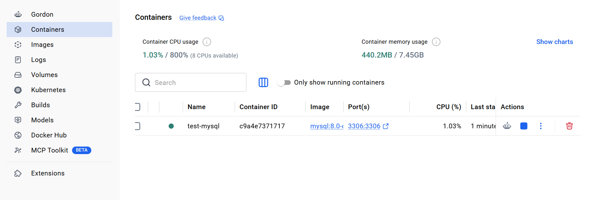
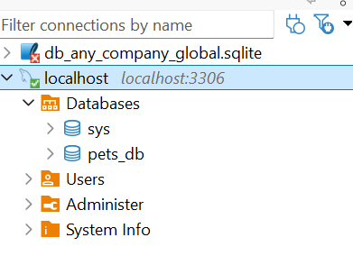
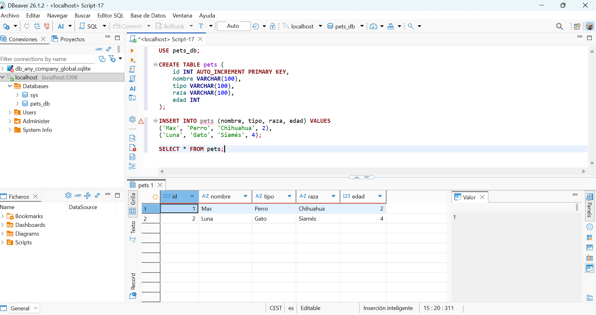
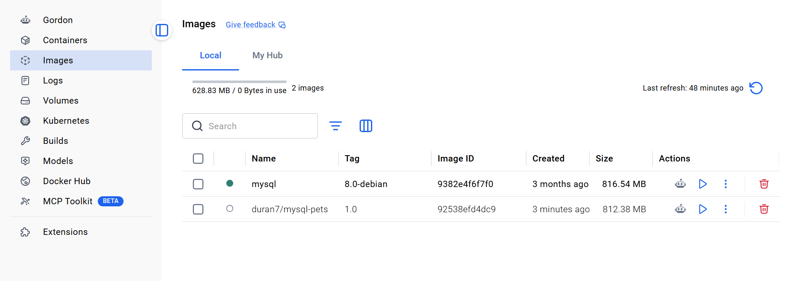

# Proyecto Docker + MySQL

## 📝 Descripción

Este proyecto consiste en aprender los conceptos básicos de Docker mediante la creación de un contenedor con una base de datos MySQL. Se descarga una imagen de MySQL desde DockerHub, se arranca un contenedor, se crea una base de datos llamada `pets_db` con una tabla de mascotas, y finalmente se sube la imagen personalizada a DockerHub.

---

## 📷 1. Imagen de MySQL en Docker Desktop



---

## 📷 2. Contenedor corriendo en Docker Desktop



---

## 📷 3. Base de datos `pets_db` en DBeaver



---

## 📷 4. Sentencia SQL para listar todas las mascotas y el resultado 

```sql
SELECT * FROM pets;
```



---

## 📷 5. Imagen subida a DockerHub



## Autora

duran-ni